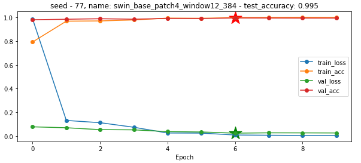
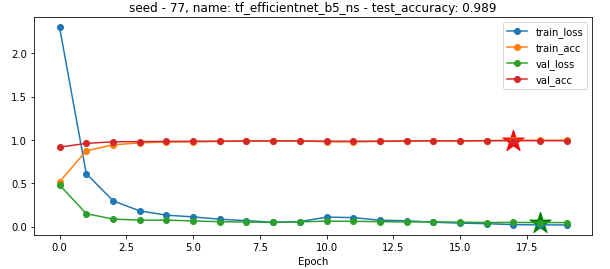

# flowers_102

# Part 1 – Aim: ANN from Scratch (40 Points)**

**Implementation - 2 hidden layer neural network**

**Forward function - 2 hidden layer neural network**

**Back propagation function - 2 hidden layer neural network**

**Updating the weights - 2 hidden layer neural network**

## Part 1 - Results:

Network convergence - Left: model 1 with 1 hidden layer. Right: model 2 with 2 hidden layers.

|Model|
Model 1 

(1 hidden, Numpy)
|
Model 2

(2 hidden, Numpy)
|
Model 3

(1 hidden, Pythorch)
|
| :- | :- | :- | :- |
|Test accuracy|96.02%|95.9%|96.8%|
|Test AUC (Macro-average)|0.99586|0.99617|0.99620|

**Part 2 (60 points) - Aim: Practice the usage of CNN (Convolutional Neural Network).** 

## preprocessing process 

## network 

**Swin Transformer**

Swin Transformer architecture splits an input RGB image into non-overlapping patches by a patch splitting module. Each patch is treated as a “token” and its feature is set as a concatenation of the raw pixel RGB values.

**Swin Transformer block** consists of a shifted window based MSA module, followed by a 2-layer MLP with GELU nonlinearity in between. A LayerNorm (LN) layer is applied before each MSA module and each MLP, and a residual connection is applied after each module. 

**Shifted window partitioning** in successive blocks The window-based self-attention module lacks connections across windows, which limits its modeling power. To introduce cross-window connections while maintaining the efficient computation of non-overlapping windows, we propose a shifted window partitioning approach which alternates between two partitioning configurations in consecutive Swin Transformer blocks

**W-MSA and SW-MSA** denote window based multi-head self-attention using regular and shifted window partitioning configurations, respectively.
# EfficientNet
EfficientNet is a convolutional neural network architecture and scaling method that uniformly scales all dimensions of depth/width/resolution using a compound coefficient. Unlike conventional practice that arbitrary scales these factors, the EfficientNet scaling method uniformly scales network width, depth, and resolution with a set of fixed scaling coefficients.

**EfficientNet-B5 Architecture **

The first thing is any network is its stem after which all the experimenting with the architecture starts which is common in all the eight models and the final layers.

Module 1 — This is used as a starting point for the sub-blocks.

Module 2 — This is used as a starting point for the first sub-block of all the 7 main blocks except the 1st one.

Module 3 — This is connected as a skip connection to all the sub-blocks.

Module 4 — This is used for combining the skip connection in the first sub-blocks.

Module 5 — Each sub-block is connected to its previous sub-block in a skip connection and they are combined using this module.

## Cross-Entropy graph for train/validation/test as a function of the number of epochs for all models.

## Final score 0.9973

